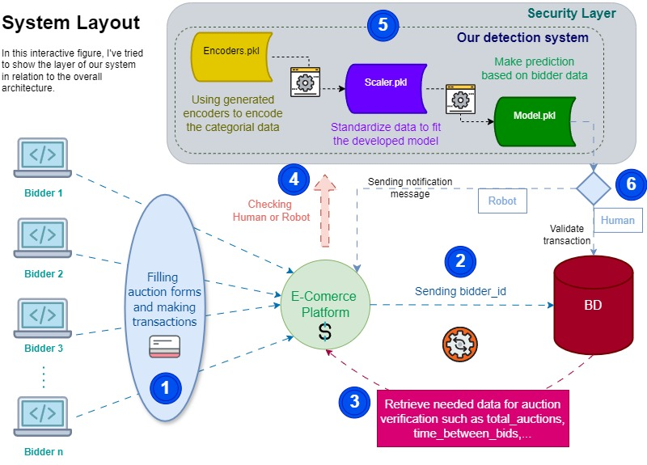

# Intelligent Detection of Automated Bidding Activity

This project aims to build a machine learning model capable of distinguishing between robotic and human bids on an e-commerce platform. With the increasing prevalence of bots in online auctions, identifying and mitigating automated bids is crucial for ensuring fair competition and enhancing user trust.

# Project Overview
The primary goal of this project is to develop a robust model that detects automated (robotic) bids in real-time by analyzing user behavior and bid patterns. This detection system is built using advanced data mining techniques, including feature extraction, exploratory data analysis (EDA), feature engineering, and predictive modeling.

   

# Key Features:
* **Bidder Behavior Analysis**: Extracts relevant features from user bidding data to capture unique behaviors of robotic and human bidders.
* **Machine Learning Models**: Multiple models were tested and optimized, including Logistic Regression, RandomForest, AdaBoost, SVM, and KNN, to find the best-performing classifier.
* **Real-Time Bid Monitoring**: The final model can be deployed to monitor bids in real-time and flag suspicious activity.
* **Web Application**: A user-friendly interface built with Streamlit allows stakeholders to test the model's predictions interactively.

### Pack of important tools:

   

# Data Description
Two datasets were used:

`train.csv` : Contains information about bidders, including their bidder_id, payment_account, and outcome (whether they are human or robotic).

`bids.csv` : Contains detailed bid-level information, such as bid_id, auction, merchandise, device, time, country, and ip.

# Data Challenges:

* **Imbalance in Target Variable**: Only 5% of the bids were labeled as robotic, which required strategies like SMOTE oversampling to balance the dataset.
* **Feature Engineering**: New features were generated to better capture the behavioral differences between human and robotic bidders, including:
    * `total_bids` : Total number of bids by a bidder.
    * `avg_time_between_bids` : Average time gap between consecutive bids.
    * `most_frequent_merchandise` : Most frequently bid-on category.
    * `most_frequent_country` : The most frequent country from which bids originated. 
    * `unique_auctions` : Number of unique auctions participated in.
    * `unique_device_ratio` : Ratio of unique devices used for bidding.
  
# Exploratory Data Analysis (EDA)

he EDA process involved analyzing missing data, visualizing relationships between features and the target variable, and understanding the distributions of key features. Some key observations:

* Robots tend to place bids much faster than humans.
* Some merchandise categories and countries are more likely associated with robotic bids.

# Model Development
Multiple **Machine Learning** models were developed, tested, and optimized:

1. Logistic Regression: The initial model was trained and then optimized using GridSearchCV.
2. RandomForest: Tuned for better performance using SelectKBest and PolynomialFeatures for feature selection.
3. AdaBoost: Optimized using RandomizedSearchCV.
4. SVM and KNN: Also tested and tuned using hyperparameter optimization.

A DNN also was implemented as a **Deep Learning** Model, using two hidden layers respectively shape 64, 32 with a "relu" activation. The input layer received our variables while the output one has used "Sigmoid" as an activation function to predict our bid.

# Model Evaluation
Each model's performance was evaluated using:

* **Confusion Matrix**
* **Precision, Recall, F1-Score**
* **Matthews Correlation Coefficient (MCC)**
* **Learning Curves**

# Deployment
The final model was deployed using a Streamlit web application. The app allows users to:

* Upload new bidding data.
* Run predictions on whether bids are human or robotic.
* Visualize results and interact with the system.
